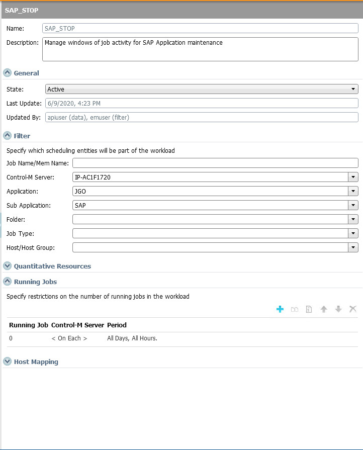

# **Managing Control-M Jobs during an Application Maintenance Window**
Time windows are sometimes required to perform maintenance on
applications and infrastructure.

During that time, Control-M jobs that depend on the services and systems
that are unavailable, must be prevented from executing. When maintenance
is complete, some of the jobs that would have run during the specific
time window should no longer be executed for that  day's processing but
other jobs in the same logical collection may need to be executed.

One organization handled this situation by "draining" all the work before
starting maintenance and then manually ordering jobs that did not have
a start time before the completion of the maintenance window.

The artifacts in this folder help automate such a process.

## **Workload Policies**

To "drain" jobs for a set of applications, activate a Workload Policy that specifies the desired application / sub-applicaiton in its filter and zero (0) for the number of jobs.

Create a policy using the Workload Automation client. Open the Workload Policies Monitor either from the Tools tab in the Monitoring domain or the Monitoring sectionof the Tools domain. Create a policy that appears similar to this:

When you are ready to activate the maintenance window "cutoff" period, activate the policy either from the Workload Policies Monitor or via Automation API. This example is using the cli:

   __ctm run workloadpolicy::activate SAP_STOP__

When the maintenance window is complete, check if unwanted jobs were submitted, and if they were, delete thise jobs. 

The next section describes a PowerShell script that checks for any jobs with a specific Application/SubApplication combination and deletes any that are found.

### **Powershell Script**
**DeleteWaitingJobs.ps1**

This script can be used to clean up any jobs that were submitted during the maintenance window but prevented from executing by the activated policy.

#### Parameters

				ctmAppl|a		Control-M application filter
				ctmSubAppl|sa	Sub-application filter
				ctmName|ctm		Control-M server name
				ctmStatus|s 	Default is "Wait Workload"
#### Example
	
	.\DeleteWaitingJobs.ps1 -a IOT -sa Preventive_Maintenance -ctm IP-AC1F1720
	
Once the maintenance window is complete, determine if any jobs were submitted during maintenance and were prevented from executing by the activated policy:

The script finds the jobs you want to process via command similar to this:
	**ctm run jobs:status::get -s "application=<application from -a parm>&subApplication=&status=<Job Status from -s parm>"**

For each found job, these operations are performed:	
	**ctm run job::hold**
	**ctm run job::delete**
	
## Continue After Cleanup
After any unwanted jobs have been cleaned up, deactivate the policy that prevented jobs from executing.

**ctm run workloadpolicy::deactivate SAP_STOP**
	
Now that the maintenanc window has been completed, there amay be jobs that you wish to order manually. Use the script in the next section to accomplish that without having to manually select the desired jobs.	

## **Powershell Script**
**OrderManualJobs.ps1**	

Powershell script that uses Automation API to read job defintions for a specified folder. Jobs with a start time prior to when this script is run (or the time specified via command line argument), are skipped. Jobs with an explicit start time after the cutoff, are submitted for execution. All other jobs are skipped.

### Parameters                             
				folder|fn			Name of the folder(s) to process. This can contain wildcards as specified for the "folder" 
									selection parameter in Automation API jobs::get funciton of the deploy service.
				
				ctmName|ctm			Name of the Control-M Server  
				
				cutoffTime|time		The time to use for determining if a job should be ordered or not                         
									'now" is the default and uses the current system time                                     
									'hh:mm" can be specified in 24-hour format, for any other time    
									
				pswdfile|pf			Fully-qualified path of a file containing the Control-M username and password.            
									if not specified, a prompt is issued to collect that information.                          
									The username is the first record and the password is the second record and are 
									case sensitive, for example:      
									myusername
									mypassword  
									
				method				Indicate if the installed and configured "ctm" cli is used or direct REST API. 
									This specification is not case-sensitive.
									rest	Use Powershell Invoke-RESTMethod. Requires Powershell 6 or higher.
									cli		Use the "ctm" cli which is assumed to be installed and configured.
									
				endpoint|ep			The fully-qualified name or IP address of the Control-M Enterprise Manager, used only     
									if method='rest' has been selected.   
				test				Bypass "Order" and only produce an informational message
				detail				Generate additional informational messages
				
### Example
				
	.\OrderManualJobs.ps1 -ctm IP-AC1F1720 -fn MY_Folder -pf .\pswd.txt -time "13:00" -method rest -ep my.emserver.com

### Processing large number of jobs

This script determines which folders and jobs to process by retrieving the job definitions for all folders selected by the folder|fn command line argument. This can be a very large number of jobs resulting in a timeout during retrieval. This situation currently results in a misleading message with text similar to the following, and no job information is returned.

**Info: Returned buffer contains nnnn folders**
**Info: Export completed successfully with nnn Folders, nnnn Smart Folders, nnn Sub Folders, and 11172 Jobs, exported to /tmp/ctmAppDev7nnnnnnnnnnn/out.xml**

The solution is to increase the timeout value as follows:
1)	Locate this file "\<Control-M EM Home>\emweb\automation-api\automation-api.properties"
2)	Add "emdef_timeout=<timeout value in thousandths of a second> - the default is 600000, which is one minute.
3)	Stop the EM Rest Server by running "emrestsrv stop" from "\<Control-M EM Home>\emweb\automation-api\bin".
4)	The server is started automatically when the next request is received.

