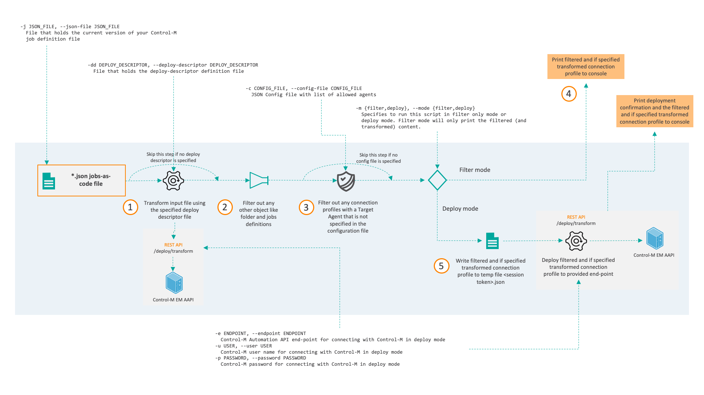

# Filter connection profile

This utility is designed to deploy connection profiles in scenarios where the application team cannot be authorized for the Control-M Configuration Manager (CCM).
It's designed to deploy connection profiles using a privileged account where the security is dealt with on a different layer (either in a CI/CD pipeline or by running this utility as a control-m job). 

In order to ensure only connection profiles will be process, it filers any other object out of a provided input file. 

> __Note:__ This script is developed and tested in a lab environment. Ensure proper testing is done before implementing this into a production environment. 

## Inroduction

This python based utility filters on connection profiles only. Allthough it is not a best practice, json files can include both job definitions as connection profiles. The authorisation model for jobs is more grannular. This utility is intended for a situation where jobs are getting deployed via a user account (oersonal or non personal) which has the required granularity configured.
The utility supports a filter only mode. This supports scenarios where the actuall deployment will be dealt with seperatly. The deployment mode will deploy the connection profile(s) to the provided end-point. It does support deploy descriptor to transform the connection_profile(s) for the targeted environment.

## Usage

```
usage: filter-connection-profile.py [-h] -j JSON_FILE [-dd DEPLOY_DESCRIPTOR]
                                    [-m {filter,deploy}] [-e ENDPOINT]
                                    [-u USER] [-p PASSWORD] [-c CONFIG_FILE]
                                    [-v] [--version]

Checks if folders are deleted from a Control-M jobs-as-code file by comparing
it with the previous version

optional arguments:
  -h, --help            show this help message and exit
  -j JSON_FILE, --json-file JSON_FILE
                        File that holds the Control-M jobs-as-code definition
                        file
  -dd DEPLOY_DESCRIPTOR, --deploy-descriptor DEPLOY_DESCRIPTOR
                        File that holds the deploy-descriptor definition file
  -m {filter,deploy}, --mode {filter,deploy}
                        Specifies to run this script in filter only mode or
                        deploy mode. Filter mode will only print the filtered
                        content.
  -e ENDPOINT, --endpoint ENDPOINT
                        Control-M Automation API end-point for connecting with
                        Control-M in deploy mode
  -u USER, --user USER  Control-M user name for connecting with Control-M in
                        deploy mode
  -p PASSWORD, --password PASSWORD
                        Control-M password for connecting with Control-M in
                        deploy mode
  -c CONFIG_FILE, --config-file CONFIG_FILE
                        JSON Config file with list of allowed agents
  -v, --verbose         Enables verbose mode
  --version             show program's version number and exit
```

### Flow

This utility follows the following flow:


